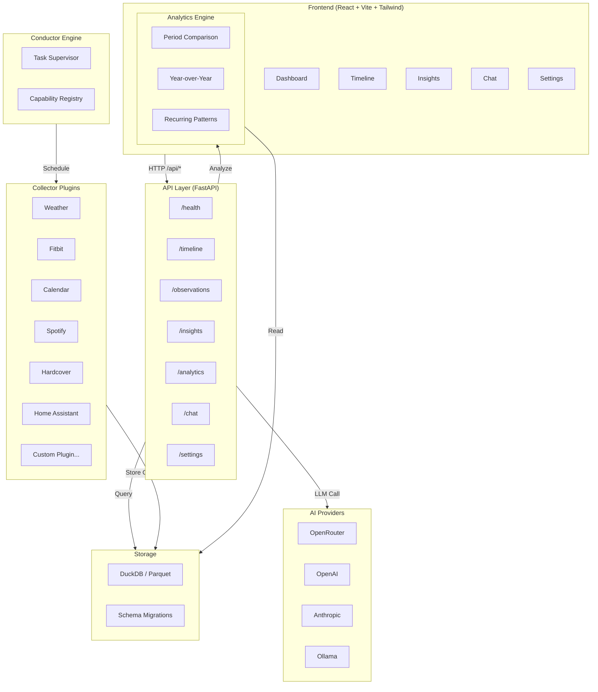

# Conductor Observatory

Personal observability platform built on [Conductor Engine](https://github.com/anomalyco/conductor-engine). Collects signals from your digital life — fitness, media, weather, home, calendar, books — into a queryable DuckDB store with an AI chat interface.

## Architecture



## Quick Start

```bash
# Backend
cd backend
uv sync
uv run uvicorn app.api.app:app

# Frontend (separate terminal)
cd frontend
npm install
npm run dev
```

Visit `http://localhost:5173` — the Vite proxy forwards `/api/*` to the FastAPI backend at `http://localhost:8000`.

## Project Structure

```
conductor-signals/
├── README.md
├── backend/
│   ├── app/
│   │   ├── api/           # FastAPI routers (health, timeline, chat, analytics, settings)
│   │   ├── analytics/     # SQL-based analytics engine (Polars + DuckDB)
│   │   ├── collectors/    # Collector plugins (registry + auto-discovery)
│   │   │   ├── base.py        # CollectorCapability base class
│   │   │   ├── registry.py    # Plugin registry with auto-discovery
│   │   │   ├── plugins/       # Drop-in external plugin directory
│   │   │   ├── fitbit.py, calendar.py, weather.py, ...
│   │   │   └── http.py, oauth.py  # Shared HTTP/OAuth utilities
│   │   ├── config.py       # pydantic-settings (OBSERVATORY_ prefix)
│   │   ├── engine.py       # Conductor Engine integration
│   │   ├── insights/       # LLM insight generation
│   │   ├── llm/            # Multi-provider LLM client
│   │   ├── schemas/        # Observation, Insight, Feature models
│   │   ├── storage/        # DuckDB repository + migrations
│   │   └── workflows/      # Conductor workflow definitions
│   ├── data/               # DuckDB database, tokens
│   ├── scripts/            # Seed script, utilities
│   └── tests/
├── frontend/
│   ├── src/
│   │   ├── api/client.ts   # Typed API client
│   │   ├── hooks/useApi.ts # Generic fetch hook
│   │   ├── pages/          # Dashboard, Timeline, Insights, Analytics, Chat, Settings
│   │   ├── components/     # Layout, MetricCard, ChatMessage, InsightCard
│   │   └── types/          # TypeScript type definitions
│   └── vite.config.ts      # /api proxy → localhost:8000
```

## Roadmap

### Done
- [x] Collector framework with base class + plugin registry + auto-discovery
- [x] 6 built-in collectors: Weather, Fitbit, Calendar, Spotify, Hardcover, Home Assistant
- [x] OAuth2 flow for Fitbit, Spotify, Calendar
- [x] DuckDB storage with schema migrations
- [x] SQL-based analytics engine (period comparison, year-over-year, recurring patterns)
- [x] LLM insight generation (diffs, trends, anomalies)
- [x] Chat endpoint with recent context (Observations + Insights)
- [x] Multi-provider LLM support (OpenRouter, OpenAI, Anthropic, Ollama)
- [x] React dashboard: Dashboard, Timeline, Insights, Analytics, Chat, Settings pages
- [x] Smooth opacity transitions (no jumpy skeletons)
- [x] Collapsible sidebar navigation
- [x] Light/dark theme toggle with localStorage persistence
- [x] LLM provider configuration UI (provider, API key, model, base URL)
- [x] Settings API endpoint (GET/PUT runtime config)
- [x] Monorepo structure (backend/ + frontend/)
- [x] SQL injection protection via `_safe()` helper
- [x] Seed script for development (200 mock observations + 7 insights)
- [x] 35 pytest tests passing, ruff + mypy clean

### In Progress
- [ ] Dynamic widget-based dashboard (drag & drop, user-configurable)
- [ ] Collector scheduling via Conductor Engine workflows
- [ ] Dockerfile + docker-compose.yml (RPi 5 multi-arch)

### Planned
- [ ] Daily digest email
- [ ] Raycast extension
- [ ] Memory-lane cards (on this day)
- [ ] Life-calendar heatmap
- [ ] Local RAG via Ollama
- [ ] Vaultwarden credential loader
- [ ] Web push notifications
- [ ] Mobile-responsive layout

## Collector Plugin System

Adding a new data source is a single-file drop-in.

### Built-in vs External

- **Built-in**: place in `backend/app/collectors/` — auto-registered via `__init_subclass__`
- **External/Plugin**: place in `backend/app/collectors/plugins/` — auto-discovered at startup

### Example Plugin

```python
"""collectors/plugins/my_tracker.py"""

from datetime import UTC, datetime
from app.collectors import CollectorCapability, CollectorInput, ObservationCreate

class MyTrackerCollector(CollectorCapability):
    collector_source = "my_tracker"      # unique source identifier
    collector_category = "health"         # grouping category

    def __init__(self, repository, **config):
        super().__init__(repository, **config)
        # Your setup here — API keys, clients, etc.

    def collect(self, _payload: CollectorInput) -> list[ObservationCreate]:
        # Fetch data from your API, sensor, etc.
        return [
            ObservationCreate(
                timestamp=datetime.now(UTC),
                source="my_tracker",
                category="health",
                entity="steps",
                features={"steps": 8432, "distance_km": 6.2},
                metadata={"device": "garmin"},
            )
        ]
```

Drop this file in `backend/app/collectors/plugins/` and the registry finds it automatically. No imports to add, no config to wire.

### Enabling/Disabling

Set environment variables to control which collectors run:

```bash
export OBSERVATORY_COLLECTOR_MYTRACKER_ENABLED=true
export OBSERVATORY_COLLECTOR_WEATHER_ENABLED=false
```

The engine checks `settings.collector_{source}_enabled` before registering.

## Configuration

All configuration via environment variables with `OBSERVATORY_` prefix:

| Variable | Default | Description |
|---|---|---|
| `OBSERVATORY_DATA_DIR` | `data/` | Data directory |
| `OBSERVATORY_LOG_LEVEL` | `INFO` | Logging level |
| `OBSERVATORY_LLM_PROVIDER` | `openrouter` | LLM provider |
| `OBSERVATORY_LLM_API_KEY` | — | API key |
| `OBSERVATORY_LLM_MODEL` | `gpt-4o-mini` | Model name |
| `OBSERVATORY_WEATHER_API_KEY` | — | OpenWeatherMap key |
| `OBSERVATORY_FITBIT_CLIENT_ID` | — | Fitbit OAuth client |
| ... | | See `app/config.py` for full list |

## Tech Stack

- **Backend**: Python 3.14, FastAPI, DuckDB, Polars, httpx, pydantic-settings, structlog, Conductor Engine
- **Frontend**: React 19, Vite 6, TypeScript 5.7, Tailwind CSS 4, Recharts 2, React Router 7
- **AI**: Multi-provider (OpenRouter, OpenAI, Anthropic, Ollama)
